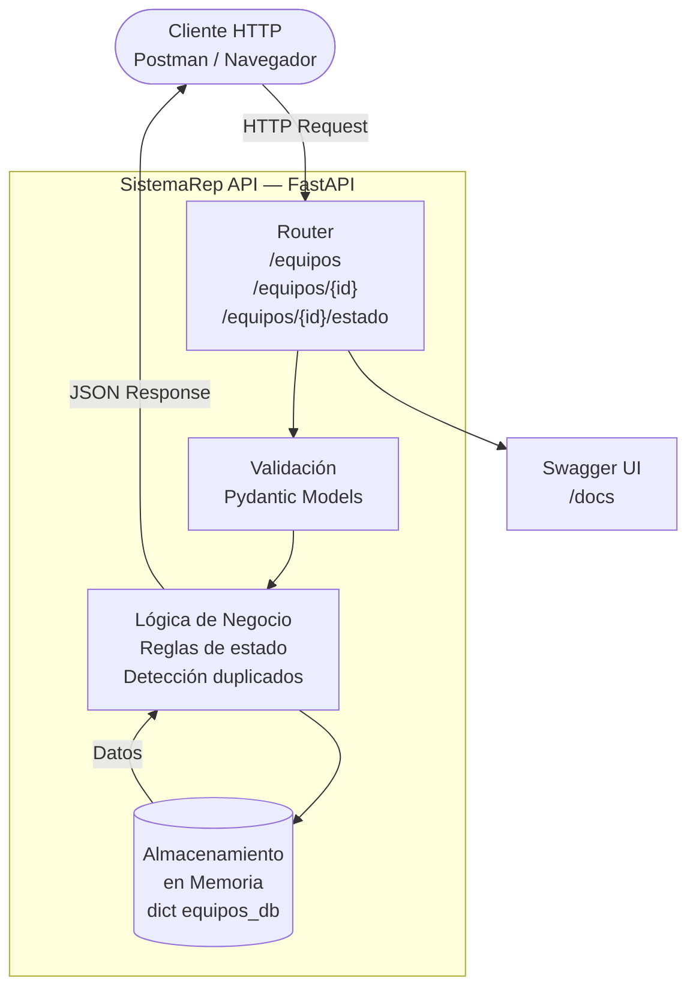
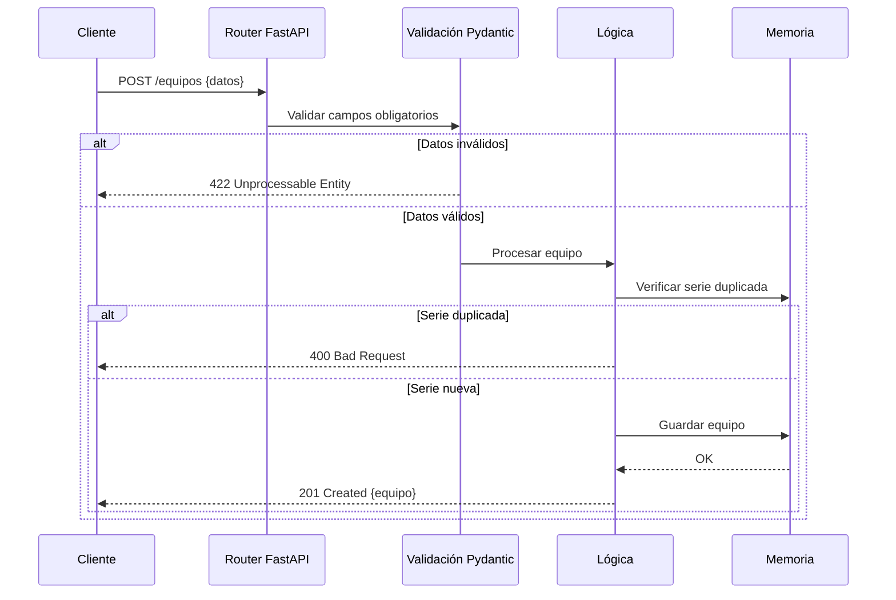

# Arquitectura — SistemaRep API

## 1. Descripción General

SistemaRep utiliza una arquitectura **monolítica simple de una sola capa**, apropiada para un MVP funcional. La API expone endpoints REST que gestionan el ciclo de vida de los equipos en reparación, desde su ingreso hasta su entrega.

El sistema está construido sobre **Python + FastAPI**, con almacenamiento en memoria durante esta fase de MVP, lo que elimina dependencias externas y permite ejecutar la API de forma inmediata sin configuración de base de datos.

---

## 2. Bloques del Sistema

| Bloque | Responsabilidad |
|--------|----------------|
| **Cliente HTTP** | Consume la API (navegador, Postman, app frontend) |
| **FastAPI Router** | Recibe y enruta las peticiones HTTP |
| **Modelos Pydantic** | Valida y tipea los datos de entrada |
| **Lógica de negocio** | Aplica reglas: estados válidos, serie duplicada, etc. |
| **Almacenamiento en memoria** | Diccionario Python que actúa como base de datos temporal |

---

## 3. Diagrama de Arquitectura

---

## 4. Flujo de una Petición

---

## 5. Decisiones Arquitectónicas

### ✅ Decisión 1 — Python + FastAPI
**Justificación:** FastAPI genera documentación Swagger automáticamente en `/docs`, valida entrada con Pydantic sin código extra, y tiene una curva de aprendizaje baja. Es ideal para MVPs de API REST modernas.

### ✅ Decisión 2 — Almacenamiento en memoria
**Justificación:** Para el MVP no se requiere persistencia entre reinicios. Un diccionario Python (`equipos_db`) elimina la necesidad de instalar y configurar una base de datos, reduciendo el tiempo de setup a cero. En producción se migraría a PostgreSQL.

### ✅ Decisión 3 — Arquitectura monolítica
**Justificación:** El sistema es pequeño y el equipo es de una persona. Una arquitectura de microservicios añadiría complejidad innecesaria en esta fase. Se puede modularizar en el futuro cuando crezca el número de endpoints.

### ✅ Decisión 4 — Sin autenticación en MVP
**Justificación:** La autenticación (JWT/OAuth) se posterga para la siguiente iteración. En el MVP se asume que la API es de uso interno del taller, accedida desde la red local.

---

## 6. Stack Tecnológico

| Componente | Tecnología | Versión |
|------------|-----------|---------|
| Lenguaje | Python | 3.10+ |
| Framework API | FastAPI | 0.110.0 |
| Servidor ASGI | Uvicorn | 0.29.0 |
| Validación | Pydantic | 2.6.4 |
| Documentación | OpenAPI / Swagger | automático |
| Base de datos | En memoria (dict) | MVP |

---

*Documento versionado — v1.0 — Febrero 2026*
