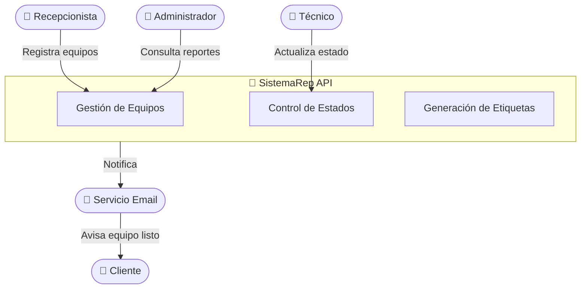
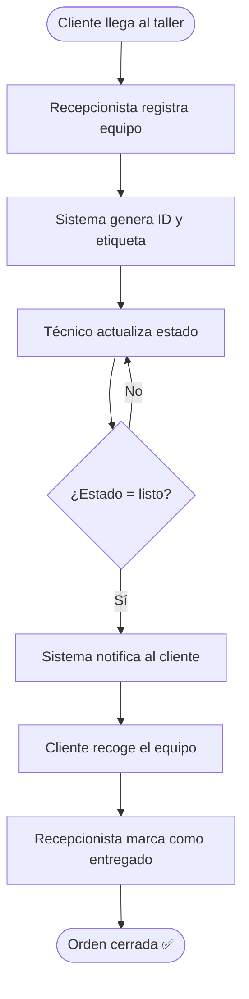

# System Brief — SistemaRep

## 1. Visión del Sistema

**SistemaRep** es una plataforma web para talleres técnicos que digitaliza el proceso completo de recepción, diagnóstico, reparación, etiquetado y entrega de equipos electrónicos. La plataforma busca reemplazar registros manuales en papel o hojas de cálculo, aportando trazabilidad, rapidez y profesionalismo al servicio técnico.

**Visión:** _"Que cada equipo ingresado al taller tenga un ciclo de vida digital completo, auditable y comunicado al cliente en tiempo real."_

---

## 2. Problema que Resuelve

Los talleres técnicos pequeños y medianos operan con procesos informales:
- Órdenes de trabajo en papel o cuadernos
- Sin trazabilidad del historial de reparaciones
- Etiquetas escritas a mano, propensas a errores
- Clientes sin visibilidad del estado de su equipo
- Entregas sin respaldo formal

**SistemaRep** centraliza todo esto en una sola herramienta accesible desde el navegador.

---

## 3. Alcance del MVP

### ✅ Incluido en MVP

| Módulo | Descripción |
|--------|-------------|
| Registro de clientes | Crear y consultar ficha del cliente |
| Recepción de equipos | Registrar equipo con marca, modelo, serie, características y falla reportada |
| Gestión de órdenes de trabajo | Crear, asignar y actualizar estado de reparaciones |
| Etiquetado | Generar etiqueta imprimible con QR y datos del equipo |
| Registro de entrega | Marcar equipo como entregado con fecha |

### ❌ Excluido del MVP (futuras versiones)

- App móvil nativa
- Módulo de inventario de repuestos
- Facturación electrónica
- Reportes estadísticos avanzados
- Multitienda / múltiples sucursales

---

## 4. Actores del Sistema

| Actor | Rol |
|-------|-----|
| **Recepcionista** | Registra equipos, crea órdenes y gestiona entregas |
| **Técnico** | Actualiza diagnóstico y estado de reparación |
| **Administrador** | Gestiona usuarios y consulta reportes |
| **Cliente** | Recibe notificaciones (no accede al sistema directamente) |

---

## 5. Diagrama de Contexto del Sistema

---

## 6. Flujo Principal

---

*Documento versionado — v1.0 — Febrero 2026*
